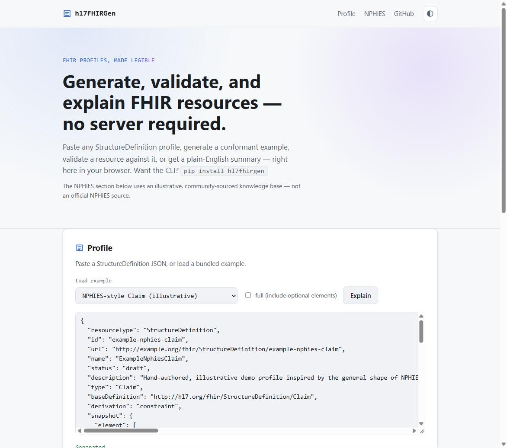
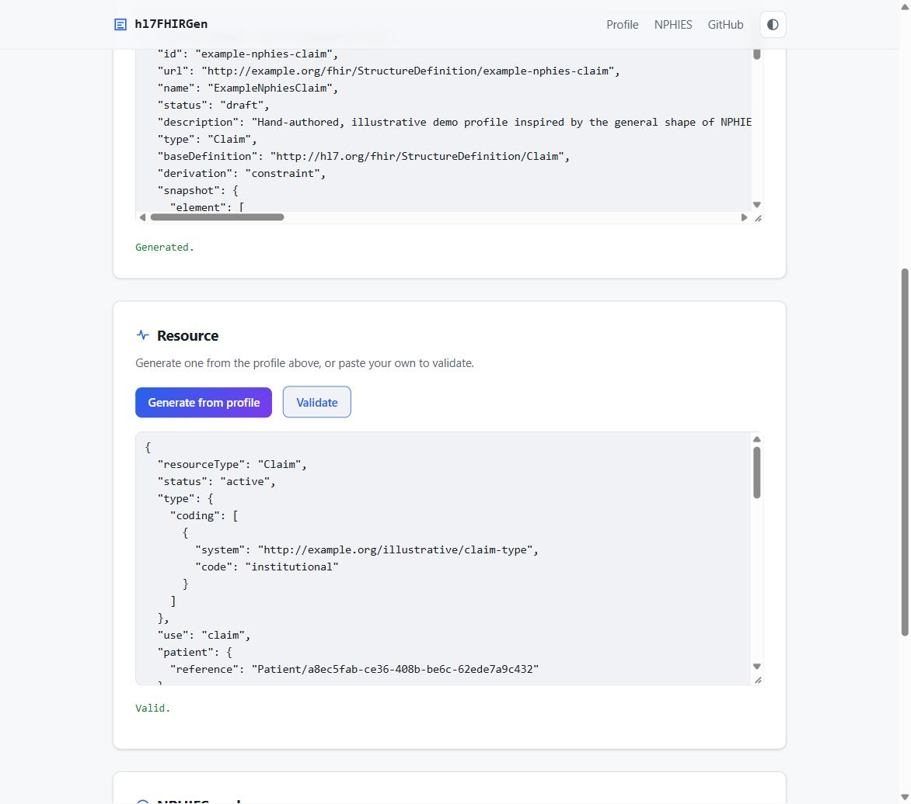
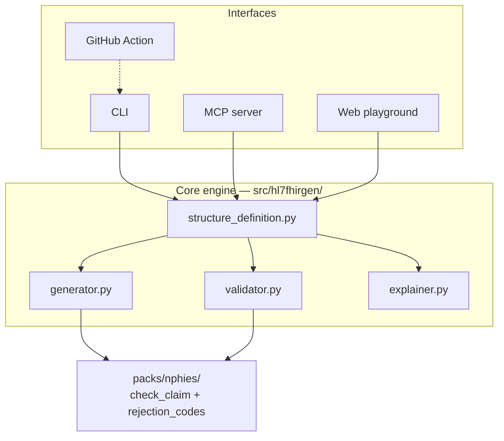

# hl7FHIRGen

[](https://github.com/mwaseem75/hl7fhirgen/actions/workflows/test.yml)
[](https://pypi.org/project/hl7fhirgen/)
[](LICENSE)

Generate, validate, and explain FHIR resources against any StructureDefinition
profile — for any FHIR IG, with no vendor lock-in. Includes an NPHIES pack for
pre-submission claim checking and rejection-code lookups.

```bash
pip install hl7fhirgen
hl7fhirgen generate my-profile.json
```

That's it — no server, no terminology service, no license required. Point it at
any StructureDefinition: a national IG like NPHIES, US Core, a custom hospital
profile, or one you're authoring yourself.

New here? **[TUTORIAL.md](TUTORIAL.md)** walks through every feature step by step,
copy-paste commands included.



## Why

Working with FHIR profiles is one of the most painful parts of implementing
FHIR in practice: reading a raw `StructureDefinition` differential to figure
out what's actually required, generating a conformant test resource by hand,
or checking a resource against a profile all normally mean either wading
through JSON yourself or reaching for a heavyweight Java validator.
`hl7fhirgen` is a small, free, scriptable tool that closes that gap for the
everyday cases: generate a conformant example, validate a resource against a
profile, and get a plain-English summary of what a profile actually requires.

## Demo

```console
$ hl7fhirgen generate examples/patient-example-profile.json --full
{
  "resourceType": "Patient",
  "identifier": [
    {
      "use": "official",
      "system": "http://example.org/mrn",
      "value": "ID-49247090"
    }
  ],
  "name": [
    { "use": "official", "family": "Haynes", "given": ["Kelly"] }
  ],
  "gender": "unknown",
  "birthDate": "1971-12-03",
  "extension": [
    {
      "url": "http://hl7.org/fhir/StructureDefinition/patient-birthPlace",
      "valueAddress": { "use": "home", "line": ["458 Charles Meadow Apt. 615"], "city": "West Sarahburgh", "postalCode": "14285", "country": "MA" }
    }
  ]
}

$ hl7fhirgen validate patient.json --profile examples/patient-example-profile.json
Valid against ExamplePatient.

$ hl7fhirgen explain examples/patient-example-profile.json
# ExamplePatient (Patient)
...
## Required elements
- `gender` [1..1] (code) — Administrative gender
- `identifier` [1..1] (Identifier) — Medical record number
- `identifier.system` [1..1] (uri)
- `identifier.value` [1..1] (string)
- `name` [1..*] (HumanName) — Patient's name
- `name.family` [1..1] (string)
- `name.given` [1..*] (string)
...
```

## Features

- **Generate** — feed it a `StructureDefinition` JSON file (from Simplifier, an
  IG build, or your own IDE) and get back a synthetic resource that satisfies
  every required and must-support element, honoring fixed/pattern values and
  standard value-set bindings. `--full` also fills in optional elements.
- **Validate** — check a resource against a profile: cardinality, fixed/pattern
  values, required-strength bindings (for the value sets it knows), and basic
  primitive-type sanity. See [Scope](#scope) — this is a documented subset of
  full FHIR conformance checking, not a replacement for the official validator.
- **Explain** — turn any `StructureDefinition` into a plain-English markdown
  summary: required elements, must-support elements, extensions, value-set
  bindings, and fixed/pattern constraints. Useful the moment you open an
  unfamiliar IG.
- **NPHIES pack** — pre-submission claim checking for Saudi Arabia's national
  FHIR claims/eligibility exchange: `nphies check-claim` validates a
  Claim/ClaimResponse-shaped resource against your own profile and explains any
  recognized rejection pattern; `nphies explain-rejection` looks one up
  directly. See [NPHIES pack](#nphies-pack) below for what this is (and isn't)
  built from.
- **Choice types handled generically** — `value[x]`-style elements (`value[x]`,
  `diagnosis[x]`, `onset[x]`, ...) resolve to their concrete JSON key
  (`valueString`, `diagnosisCodeableConcept`, ...) automatically, in both
  generation and validation.
- **MCP server** — exposes `generate_fhir_resource`, `validate_fhir_resource`,
  `explain_profile`, and the NPHIES pack's tools to any MCP-capable client
  (Claude Desktop, Claude Code, etc.) — see [MCP server](#mcp-server) below.
- **GitHub Action** — run generate/validate/explain in CI — see
  [GitHub Action](#github-action) below.
- **Web playground** — try generate/validate/explain/NPHIES check-claim in the
  browser, no install required — see [Web playground](#web-playground) below.

## CLI

```bash
hl7fhirgen generate my-profile.json --full --out patient.json
hl7fhirgen validate patient.json --profile my-profile.json
hl7fhirgen explain my-profile.json --out summary.md
hl7fhirgen nphies check-claim claim-response.json --profile my-profile.json
hl7fhirgen nphies explain-rejection duplicate-claim
hl7fhirgen nphies list-rejections
```

## NPHIES pack

[NPHIES](https://portal.nphies.sa/ig/index.html) is Saudi Arabia's national platform
for electronic healthcare financial transactions between providers and insurers:
coverage eligibility checks, prior authorizations, claim submission (including batch
claims), payment reconciliation, and claim cancellation. It's built on **HL7 FHIR
R4.0.1** via the "Healthcare Financial Services" Implementation Guide, published by HL7
Saudi Arabia at [portal.nphies.sa](https://portal.nphies.sa/ig/index.html). Every
hospital, clinic, and insurer operating in the Kingdom integrates with it, and the
rejection/adjudication codes that come back on a denied or errored claim are notoriously
hard to act on from raw JSON alone — there's little open, developer-friendly tooling
around it. The NPHIES pack adds two things on top of the generic engine:

```bash
hl7fhirgen nphies check-claim my-claim-response.json --profile my-nphies-profile.json
hl7fhirgen nphies explain-rejection duplicate-claim
```

- `check-claim` runs the same generic validator against **whatever profile you
  supply** (bring your own copy of a real NPHIES profile from the NPHIES
  developer portal) and cross-references any `error[].code.coding[].code`
  found on the resource against a bundled rejection-pattern knowledge base.
- `explain-rejection` / `list-rejections` look a pattern up directly.

**Important:** the rejection-code knowledge base
(`hl7fhirgen.packs.nphies.rejection_codes`) ships with a handful of
**illustrative example entries** seeding its structure — it is a
community-maintained lookup table, not an official mirror of NPHIES's actual
terminology. hl7fhirgen has no live feed of NPHIES's CodeSystem. Every result
carries a disclaimer; verify against the current NPHIES IG and your payer
contract before acting on a real claim decision. Nothing in this pack was
built from non-public NPHIES material — see `CONTRIBUTING.md` to contribute a
real rejection pattern you've encountered.

## MCP server

```bash
pip install "hl7fhirgen[mcp]"
```

Exposes 6 tools over the [Model Context Protocol](https://modelcontextprotocol.io):
`generate_fhir_resource`, `validate_fhir_resource`, `explain_profile`,
`nphies_check_claim`, `nphies_explain_rejection`, `nphies_list_rejection_codes`.
Runs locally over stdio — an MCP client launches `hl7fhirgen-mcp` as a
subprocess, no network or Docker involved. Tools take profile/resource JSON as
strings, not file paths, so they work regardless of the client's filesystem
access.

For Claude Code: this repo ships a `.mcp.json`, so opening it in Claude Code
makes the server available automatically. For other clients, point them at the
`hl7fhirgen-mcp` command (installed by the `mcp` extra above).

### Using the tools

In a chat-based client (Claude Desktop, Claude Code, ...) you don't call a tool
directly — you just ask in plain language, with the profile/resource pasted or attached,
and the model picks the right tool:

> "Here's a StructureDefinition — generate a test Patient for it and tell me what's required."
> → calls `explain_profile` and `generate_fhir_resource`
>
> "Does this ClaimResponse pass validation, and why was it rejected?"
> → calls `nphies_check_claim`

For a programmatic MCP client — or just to see the exact shape each tool expects and
returns — here's every tool's arguments and a real result (`profile_json`/
`resource_json` values are truncated below; they're the full JSON text of a
StructureDefinition/resource, same as the bundled `examples/` files):

**`generate_fhir_resource`** — `{"profile_json": "...", "include_optional": false}` →
```json
{
  "resourceType": "Patient",
  "identifier": [{ "use": "official", "system": "http://example.org/mrn", "value": "ID-87669842" }],
  "name": [{ "use": "official", "family": "Hughes", "given": ["Patricia"] }],
  "gender": "unknown",
  "birthDate": "2013-09-24"
}
```

**`validate_fhir_resource`** — `{"resource_json": "...", "profile_json": "..."}` →
```json
{
  "valid": false,
  "issues": [
    { "severity": "error", "path": "identifier", "message": "required (min cardinality 1) but found 0" },
    { "severity": "error", "path": "name", "message": "required (min cardinality 1) but found 0" },
    { "severity": "error", "path": "gender", "message": "required (min cardinality 1) but found 0" }
  ]
}
```

**`explain_profile`** — `{"profile_json": "..."}` → the same markdown shown in the
[Demo](#demo) section above, as a single string.

**`nphies_check_claim`** — `{"resource_json": "...", "profile_json": "..."}` →
```json
{
  "valid": true,
  "issues": [],
  "rejection_explanations": [
    {
      "code": "duplicate-claim",
      "title": "A claim for this patient/service/date appears to already be on file",
      "likely_causes": ["The claim was already submitted and is still processing", "A resubmission was sent without referencing the original claim"],
      "suggested_fix": "Check claim status before resubmitting; if correcting an earlier claim, reference it explicitly rather than submitting a fresh one."
    }
  ],
  "disclaimer": "Community-sourced guidance seeded with illustrative examples, not an official NPHIES source. Verify against the current NPHIES Implementation Guide and your payer contract before acting on a real claim decision."
}
```

**`nphies_explain_rejection`** — `{"code": "duplicate-claim"}` →
```json
{
  "title": "A claim for this patient/service/date appears to already be on file",
  "likely_causes": ["The claim was already submitted and is still processing", "A resubmission was sent without referencing the original claim"],
  "suggested_fix": "Check claim status before resubmitting; if correcting an earlier claim, reference it explicitly rather than submitting a fresh one.",
  "disclaimer": "Community-sourced guidance seeded with illustrative examples, not an official NPHIES source. Verify against the current NPHIES Implementation Guide and your payer contract before acting on a real claim decision."
}
```

**`nphies_list_rejection_codes`** — `{}` →
```json
{ "codes": ["diagnosis-not-covered", "duplicate-claim", "eligibility-expired", "invalid-provider-id", "missing-preauth"] }
```

Every one of these was run against the real server, not hand-written — see
`tests/test_mcp_server.py` for the same calls as an automated suite.

### Claude Code plugin

```
/plugin marketplace add mwaseem75/hl7fhirgen
/plugin install hl7fhirgen@hl7fhirgen-marketplace
```

Bundles the MCP server above with a skill (`SKILL.md`) that teaches Claude when
to reach for hl7fhirgen and flags real gotchas discovered while building it
(array-vs-scalar JSON shape, choice-type resolution, per-instance cardinality,
the NPHIES pack's disclaimer).

## GitHub Action

```yaml
- uses: mwaseem75/hl7fhirgen/action@master
  with:
    command: validate
    profile-path: profiles/my-profile.json
    resource-path: test-data/patient.json
```

Wraps the CLI's `generate`/`validate`/`explain` commands for CI — e.g. gate a
PR on every test resource still validating against your profile. See
`action/action.yml` for all inputs.

## Web playground

Run locally:

```bash
docker compose up --build
```

Open http://localhost:8000 — generate, validate, explain, and run the NPHIES pack's
`check-claim` entirely in the browser, with the same bundled examples the CLI/tests use.



**Deploy your own copy to Render:** connect this repo on [Render](https://dashboard.render.com)
via **New +** → **Blueprint** — it picks up `render.yaml` and deploys `webapp/Dockerfile`
automatically (free tier).

## Scope

Full FHIR conformance validation — terminology services, slicing
discriminators, cross-element invariants (`.constraint`), full base-resource
merging of differentials — is a large, multi-year effort the official
[HL7 FHIR Validator](https://confluence.hl7.org/display/FHIR/Using+the+FHIR+Validator)
already does well. `hl7fhirgen` doesn't try to replace it. What it does today:

- Reads `snapshot.element` (the normal case for any profile from an IG,
  Simplifier, or an authoring tool); falls back to `differential.element` with
  a caveat if no snapshot is present — inherited base elements not listed in
  the differential won't be generated or checked.
- Honors `min`/`max` cardinality, `fixed[x]`/`pattern[x]`, and `required`/
  `extensible`-strength bindings for the small set of well-known value sets it
  ships with (administrative-gender, name-use, identifier-use, contact-point
  system/use). Other bindings are recognized but not checked against an actual
  terminology server.
- Detects array-vs-scalar JSON shape correctly for the common FHIR elements
  that are always arrays in the base spec (`identifier`, `name`, `telecom`,
  `address`, `given`, `extension`, `coding`, etc.) even when a profile narrows
  them to `0..1` — FHIR's JSON shape follows the *base* resource, not the
  profile's narrowed cardinality. Elements outside that list rely on the
  profile's own max and can be wrong if narrowed from a repeating base field
  we don't recognize.
- Extension value-type detection works when a profile inlines `value[x]` for
  the slice (as the bundled example does) or you otherwise know the type;
  since v1 doesn't fetch external extension `StructureDefinition`s over the
  network, an extension slice with no inline `value[x]` gets a generic
  `valueString` placeholder.
- Slicing support beyond extensions is best-effort: a repeating element with
  multiple named slices generates using the first slice's constraints only
  (this also applies to validation's cardinality/type checks for that group).
- Choice-type elements (`value[x]`, `diagnosis[x]`, etc.) are resolved to their
  concrete JSON key automatically, both generating and validating.
- Cardinality and other per-element checks are evaluated per parent instance,
  not flattened across the whole resource — a repeating `Claim.item` with a
  `0..1 Claim.item.quantity` is checked per item, not pooled.

None of this is hidden — `hl7fhirgen validate` reports exactly what it
checked, and unsupported constructs are meant to fail loudly rather than
silently pass.

## Architecture

Every interface (CLI, MCP server, web playground, GitHub Action) is a thin wrapper
around the same core engine — there's exactly one place that knows how to parse a
StructureDefinition, generate against it, or validate against it.



## Project layout

```
src/hl7fhirgen/         core package (structure_definition, generator, validator, explainer, fhir_datatypes, cli, mcp_server)
src/hl7fhirgen/packs/   vertical packs built on the generic engine (nphies: check_claim, rejection_codes)
webapp/                 FastAPI web playground + static frontend
examples/               hand-authored demo profiles used in the README and tests (including examples/nphies/)
action/                 GitHub Action wrapping the CLI
tests/                  pytest suite
```

## Working with this repo

Clone it and set up a dev install with every optional feature (MCP server + web
playground) enabled:

```bash
git clone https://github.com/mwaseem75/hl7fhirgen.git
cd hl7fhirgen
pip install -e ".[dev,mcp,webapp]"
pytest
```

From there:

```bash
# Try the CLI against a bundled example — no network, no external profile needed
hl7fhirgen generate examples/patient-example-profile.json --full
hl7fhirgen explain examples/nphies/claim-example-profile.json

# Run the web playground locally without Docker
uvicorn webapp.main:app --reload
# then open http://localhost:8000

# ...or with Docker, matching how it deploys
docker compose up --build
```

Every module has a matching test file in `tests/` (`structure_definition.py` ↔
`test_structure_definition.py`, and so on) — `pytest -k <name>` runs just one. See
`CONTRIBUTING.md` for the full project layout, testing conventions, and how to report a
profile that generates or validates incorrectly, and `TUTORIAL.md` for a guided walk
through every feature. `CHANGELOG.md` tracks released versions. Every public function
and class has a docstring — `help(hl7fhirgen.generator)` (or your editor's
hover/go-to-definition) works from a plain `pip install`.

## Roadmap

- Optional `--strict` mode that shells out to the official validator jar for
  authoritative validation when installed.
- Grow the NPHIES rejection-code knowledge base with real, community-reported
  patterns (see `CONTRIBUTING.md`).

## License

MIT — see `LICENSE`.
